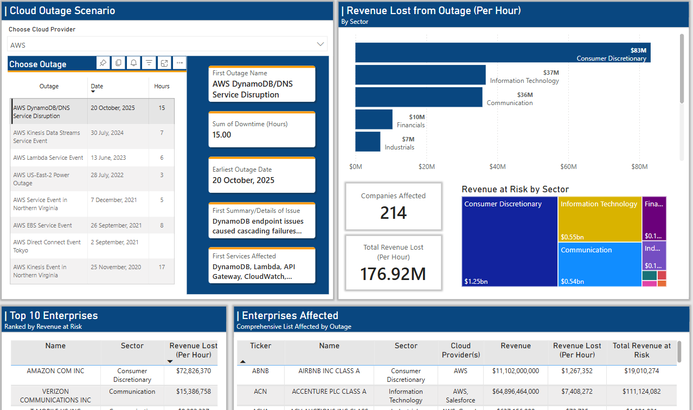

# Enterprise Cloud Outage Analysis

Analyzing the financial impact of cloud outages on major U.S. enterprises through SEC 10-K filings.

<p>
  
  
</p>

---

## Executive Summary

Cloud-based infrastructure has become a core strategy for many modern enterprises in their daily operations. Yet when major providers experience outages, seen with AWS's multi-hour disruptions and Azure global service failure, the financial impact can be seen across the market.

This project answers the question: 
> **How much revenue is at risk when cloud providers go down?**

By parsing 12,000+ SEC 10-K filings from 2,500+ companies (2020–2025), I mapped each company's dependencies to specific cloud providers and calculated hourly revenue exposure during ~34 major outages.

---

## Motivation

With the recent news of outages from major cloud providers, I wanted to explore and do a risk assessment on the financial impact an outage from one of the major cloud providers has on the market. When AWS experienced a DynamoDB/DNS Service Disruption (October 2025), operations across the internet halted for up to 15 hours.

> **Problem:** Companies don't voluntarily disclose their cloud architecture details, and third-party databases are incomplete or expensive.

> **My Solution:** Leverage SEC-mandated 10-K filings, specifically the Risk Factors section (Item 1A), where companies are legally required to disclose material risks to their business operations, including technology dependencies.

This approach transforms required annual documents into unique data for cloud dependency mapping for over 2,500 enterprises—information that is difficult to find elsewhere in the public domain.

---

## Key Findings

- **AWS dominates enterprise cloud adoption** at 70% market share among companies disclosing specific providers
- **Cloud dependency is accelerating:** 62% of companies mentioned cloud reliance in 2020 filings vs. 77.6% in 2025
- **A single AWS outage (DynamoDB/DNS Disruption, Oct 2025)** put $2.5B+ in total revenue at risk across 214 affected companies
- **Information Technology, Communication, and Financial sectors** show the highest cloud concentration risk, while **Real Estate, Consumer Staples, and Materials sectors** show little reliance on cloud services

---

## Analysis

### Market Composition

The analysis covers $72.78 trillion in market capitalization across 11 sectors:


### Cloud Adoption Trend (2020–2025)


> **Insight:** A 15+ percentage point increase in cloud risk disclosures over 5 years reflects accelerating enterprise cloud migration.


> **Insight:** 25% of enterprises do not mention relying on cloud services or find it not material enough to disclose.

### Provider Market Share


> *Note: Totals exceed 100% due to multi-cloud deployments.*

### Sector-Provider Dependency Heatmap


> **Insight:** IT sector shows highest absolute cloud dependency (207 provider mentions). AWS dominance is most pronounced in Communication and Consumer Discretionary sectors.

---

## Outage Scenario Analysis

### Summary by Provider


---

### 1. AWS: DynamoDB/DNS Service Disruption (October 2025)

**One of the largest cloud disruptions in recent news.**


| Metric | Value |
|--------|-------|
| Duration | 15 hours |
| Companies Affected | 214 |
| Hourly Revenue at Risk | $176.92M |
| **Total Revenue at Risk** | **$2.5B+** |

**Top 5 Companies by Hourly Exposure:**

| Company | Sector | Hourly Revenue at Risk |
|---------|--------|------------------------|
| Amazon | Consumer Discretionary | $72.8M |
| Verizon | Communication | $15.4M |
| T-Mobile | Communication | $9.3M |
| Accenture | Information Technology | $7.4M |
| Capital One | Financials | $4.5M |

**Sector Breakdown:**
- Consumer Discretionary: $83M/hour (led by Amazon)
- Information Technology: $37M/hour
- Communication: $36M/hour

---

### 2. Azure: Firewall and Data Explorer Outage (June 2022)


| Metric | Value |
|--------|-------|
| Duration | 24 hours |
| Companies Affected | 81 |
| Hourly Revenue at Risk | $60.84M |
| **Total Revenue at Risk** | **$1.46B** |

**Top 5 Companies by Hourly Exposure:**

| Company | Sector | Hourly Revenue at Risk |
|---------|--------|------------------------|
| Microsoft | Information Technology | $27.9M |
| Nvidia | Information Technology | $6.9M |
| Oracle | Information Technology | $6.0M |
| Medtronic | Health Care | $3.7M |
| ServiceNow | Information Technology | $1.3M |


---

### 3. GCP: Fiber Cuts Network Disruption (June 2022)


| Metric | Value |
|--------|-------|
| Duration | 3 hours |
| Companies Affected | 62 |
| Hourly Revenue at Risk | $98.16M |
| **Total Revenue at Risk** | **$294M** |

**Notable Insight:** Despite GCP's smaller market share, its per-hour impact rivals AWS due to high-revenue companies like Alphabet (Google) being self-hosted on GCP infrastructure.

---

## Methodology

### Data Extraction Pipeline


### Cloud Provider Detection

I targeted five major cloud infrastructure providers based on market dominance:

| Provider | Detection Keywords |
|----------|-------------------|
| AWS | Amazon Web Services, AWS, EC2, S3, Lambda |
| Azure | Microsoft Azure, Azure Cloud |
| GCP | Google Cloud Platform, GCP, Google Cloud |
| Oracle | Oracle Cloud Infrastructure, OCI |
| IBM | IBM Cloud, IBM Watson |

### Classification System

Each company was categorized into one of three buckets based on 10-K content:

| Category | Definition | Count |
|----------|------------|-------|
| **Specific Cloud** | Explicitly names one or more cloud providers | 306 |
| **General Cloud** | Mentions cloud dependency without naming providers | 1,626 |
| **No Cloud Mention** | No cloud-related risk factors disclosed | 628 |

### Context-Aware Scoring

Problem: distinguishing between companies that *use* a cloud provider versus those that *compete* with one (e.g., AWS mentioning Azure as a competitor, not a dependency).

**Solution:** Implemented a context scoring algorithm to classify cloud provider dependencies in 10-K filings. The algorithm analyzes surrounding sentences using regex pattern matching, assigning higher scores to dependency indicators like "rely," "depend," "utilize," and "infrastructure," while assigning lower scores for wordings like "competitor" and "compete."

### Revenue Risk Calculation

Pulled in market data using Yahoo Finance API (yfinance) for each company's annual revenue and market capitalization. From there, I calculated the hourly revenue and determined the total revenue at risk during each outage.

```
Hourly Revenue = Annual Revenue (2024) / 8,760 hours

Revenue at Risk (per outage) = Hourly Revenue × Outage Duration (hours)
```

---

## Data Schema


---

## Limitations & Assumptions

1. **Multi-Cloud Reality Understated:** Russell 3000 companies likely employ multi-cloud or hybrid architectures with failover capabilities. This analysis models a worst-case scenario where primary cloud dependencies experience complete service interruption without redundancy.

2. **Revenue Timing Not Modeled:** Hourly revenue calculations assume uniform revenue distribution across all hours. In reality, a retail company's 1 AM outage impacts revenue differently than a 1 PM outage. Time-of-day and seasonality adjustments were not applied.

3. **Provider Disclosure Gaps:** Companies in the "General Cloud" category (1,626) acknowledge cloud dependency but don't specify providers. This may reflect security-conscious disclosure practices (common in financial services) or multi-cloud strategies without a dominant provider.

4. **Competitor vs. Dependency Disambiguation:** While the context-scoring algorithm handles most edge cases, some misclassifications may occur when companies discuss cloud providers in mixed contexts.

5. **2024 Revenue Baseline:** All revenue-at-risk calculations use 2024 annual revenue, which represents the most complete and recent fiscal year data available at time of analysis.

6. **Sector Revenue Distribution:** Different sectors have varying revenue models. A subscription SaaS company may experience immediate revenue impact during an outage, while a manufacturing company with cloud-dependent logistics may see delayed effects.

---

## Technical Implementation

### Technology Stack

| Component | Technology |
|-----------|------------|
| Data Extraction | Python, SEC EDGAR API |
| Text Processing | Pandas, Regex, NLTK |
| Financial Data | yfinance |
| Data Storage | PostgreSQL, CSV |
| Visualization | Power BI |
| Version Control | Git |

### Data Sources

| Source | Purpose | Records |
|--------|---------|---------|
| SEC EDGAR API | 10-K filings (2020–2025) | ~12,000 documents |
| Yahoo Finance (yfinance) | Company financials, sector classification | 2,500+ companies |
| Public Outage Reports | Historical cloud outages | ~34 incidents |

---

## Author

**Kenneth Nguyen**

[LinkedIn](#) | [Portfolio](#)
